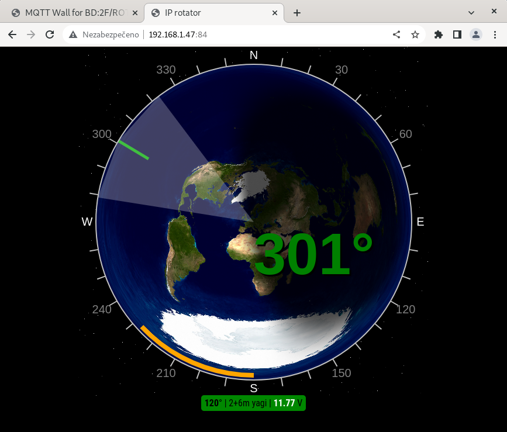

# IP-rotator firmware
- MQTT based IP control firmware, for 3D printed rotator
- Web preview
- Main repository [Parameterizable 3D print Antenna rotator in OpenScad](https://github.com/ok1hra/Parameterizable-3D-print-Antenna-rotator-in-OpenScad)

